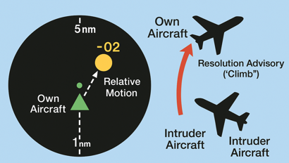
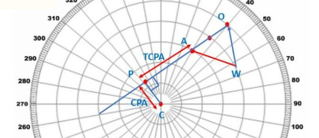

# 3D Space Trajectory Planning for Airplane Navigation Using Reinforcement Learning
## over-view
This project focuses on developing an AI-based navigation system that enables airplanes to autonomously plan safe and efficient trajectories in 3D airspace using Reinforcement Learning (RL). The system continuously monitors aircraft positions, velocities, and headings to compute the Closest Point of Approach (CPA: the minimum separation distance between aircraft) to detect potential collisions.
A reinforcement learning agent is trained to generate optimal navigation commands (adjusting heading, altitude, and speed) to maintain safe separation and avoid mid-air collisions. The agent receives rewards for maintaining safe distances and efficient trajectories while being penalized for unsafe maneuvers. It learns through simulated environments using algorithms like Deep Q-Networks (DQN), Proximal Policy Optimization (PPO), or Soft Actor-Critic (SAC).
The system aims to enhance autonomous flight capabilities, reduce reliance on predefined flight paths, and improve air traffic management efficiency while ensuring compliance with aviation safety standards such as TCAS II.

## Components
1-CPA/TCPA Conflict Simulator
Adjust Latitude, Longitude, and Altitude of aircraft
Modify safety zone thresholds
Simulates predicted Closest Point of Approach (CPA) and Time to CPA (TCPA)

2-ADS-B Real-Time CPA/TCPA Viewer
View real-time aircraft positions from ADS-B data
Change CPA safety threshold and prediction time window
Highlights conflict warnings when thresholds are exceeded

3-RL Aircraft Real-Time Simulation
Animated intruder aircraft simulate dynamic conflict conditions
Reinforcement Learning agent adjusts trajectory to maintain safe separation

## Test Methods
1 - Simulate equipment reliability through estimated MTBF qualified life in environment

2 - Use components that are rated for operation at temperatures of -20F to 120F

3 - Test CPA/TCPA logic by manually adjusting aircraft positions and observing predicted outputs

4 - Adjust ADS-B parameters and CPA thresholds to validate conflict detection accuracy

5 - Simulate animated intruders using RL to observe collision avoidance in real time

6 - Monitor vertical resolution advisories (e.g., “Level Off”) in response to CPA violations

7 - Evaluate system performance with multiple simultaneous intruders

8 - Log alert timing and ensure system meets response expectations

9 - Confirm TCAS goes into standby mode upon simulated Mode S transponder failure

10 - Simulate lightning strikes and follow IEEE 998-1996

11 - Compare RL actions to standard TCAS RA logic under similar conditions

12 - Verify alert clarity and correctness based on varying tau and threshold values

